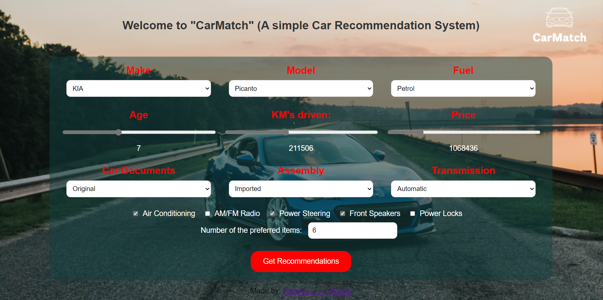
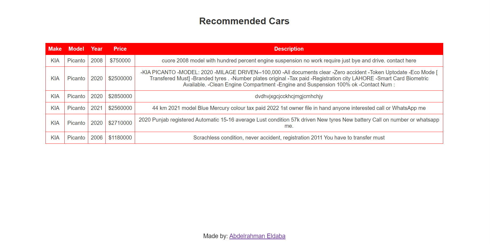

# Car Recommendation System

Welcome to the Car Recommendation System, a web application designed to help users find their ideal car based on various preferences. It's a task at my Artifcial Intelligence intern from [TeknoSoft](https://www.linkedin.com/company/teknosoft/?lipi=urn%3Ali%3Apage%3Ad_flagship3_search_srp_all%3BoByoC2OZTqC2TxA5M7YEXA%3D%3D).

---

## Features
- Dynamic Selection: Choose your preferred car make and model dynamically.
- Interactive Sliders: Adjust age, kilometers driven, and price range to refine your search.
- Additional Features: Select optional features like air conditioning and power steering.
- Customizable Limit: Set the number of preferred car recommendations.

Feel free to explore, provide feedback, and connect with me for discussions and collaborations! 🤝🚀

- Explore the notebook on [Kaggle](https://www.kaggle.com/code/abdelrahmanahmed110/cars-recommendation-system) 🚀
- Check out my website with a portfolio [Here](https://sites.google.com/view/abdelrahman-eldaba110) 🌟
- Connect with me on [LinkedIn](https://www.linkedin.com/in/abdelrahmaneldaba) 🌐

